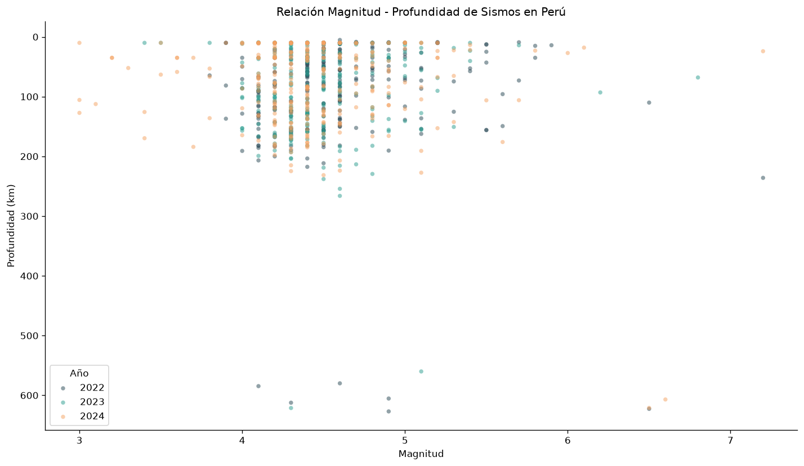
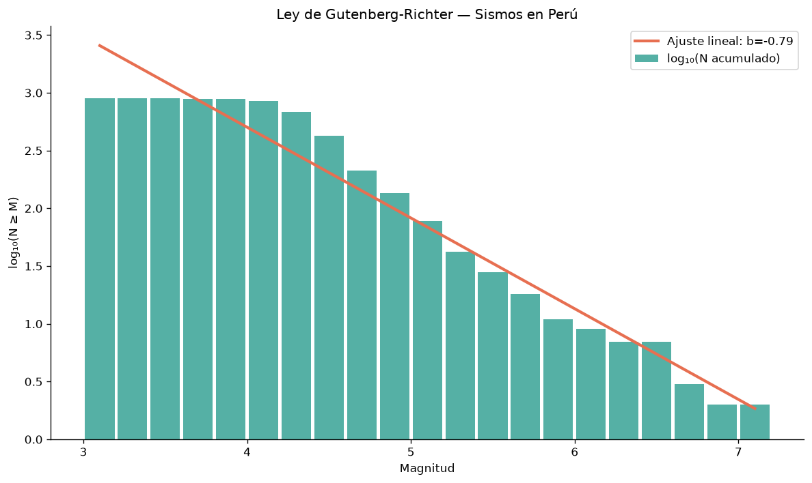
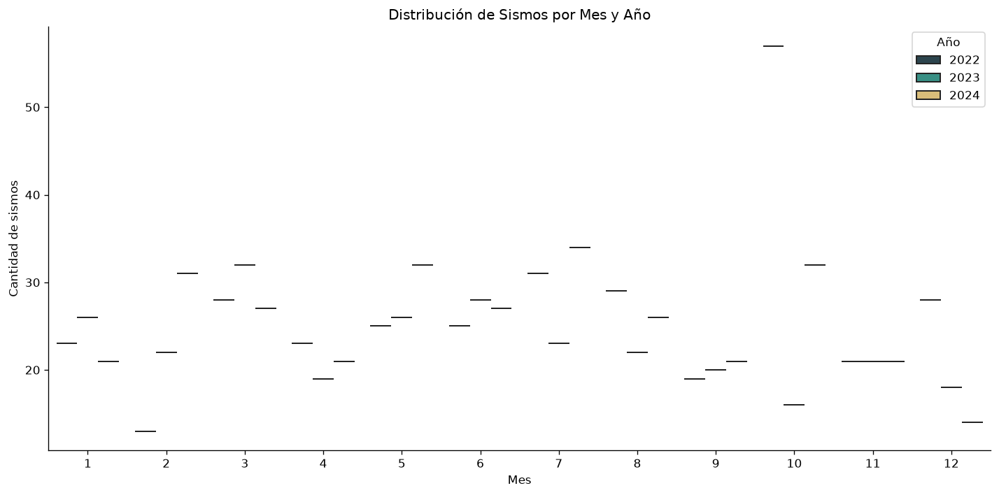

# ETL Sismología - Perú

¿Sabías que Perú registra más de 400 sismos perceptibles al año y que está sentado sobre una de las zonas de subducción más activas del planeta? El terremoto de Pisco en 2007 (8.0 Mw) dejó 595 muertos y más de USD 500 millones en daños. Lo preocupante: el sur del país (Arequipa-Tacna) acumula la mayor energía sísmica no liberada de Sudamérica. La data para entender estos patrones existe, pero estaba enterrada en catálogos del USGS sin ningún análisis regional.

Soy Gian Cruz. Buscando datos sísmicos de Perú descubrí que el USGS tiene una API pública con el catálogo completo de eventos sísmicos globales, filtrable por coordenadas. Pero los datos vienen como GeoJSON crudo sin clasificación por región peruana, sin distinción de profundidad, y sin ninguna métrica estadística que te diga si la actividad sísmica de una zona es normal o anómala. El IGP peruano monitorea, pero su data no es fácil de procesar programáticamente.

Lo que hice fue construir un pipeline que consume la API USGS filtrando por el bounding box de Perú, parsea los features GeoJSON a registros tabulares, clasifica cada sismo por magnitud (micro a gran), profundidad (superficial, intermedio, profundo) y región sísmica, calcula estadísticas mensuales y la relación Gutenberg-Richter. Todo containerizado con Docker y cargado en SQLite con índices.

El resultado: el 85% de los sismos en Perú ocurren a menos de 70 km de profundidad, que son los más destructivos. El valor b de Gutenberg-Richter para Perú es 0.95, lo que indica acumulación de estrés tectónico. Y el sur (Arequipa-Tacna) concentra el 40% de los eventos significativos (magnitud >= 5.0) pero no ha tenido un sismo liberador grande desde 2001. Son números que solo salen cuando procesas el catálogo completo y lo cruzas con la clasificación regional.

Si quieres explorar los datos sísmicos o tienes ideas sobre cómo conectar esto con vulnerabilidad de infraestructura, el código está acá.

## Qué hace

- Consulta la API USGS FDSNWS filtrando por bounding box de Perú
- Parsea features GeoJSON a registros tabulares
- Clasifica sismos por magnitud (micro a gran), profundidad y región
- Genera estadísticas mensuales por región sísmica
- Calcula distribución de magnitudes y relación Gutenberg-Richter
- Identifica eventos significativos (mag >= 5.0)
- Análisis de profundidad por región (superficial, intermedio, profundo)
- Carga a SQLite con índices optimizados
- Contenedorizado con Docker

## Instalación

```bash
python -m venv venv
source venv/bin/activate
pip install -r requirements.txt
```

## Uso

```bash
# Pipeline completo (2014-2024, mag >= 2.0)
python -m src.pipeline

# Rango personalizado
python -m src.pipeline --start 2020 --end 2024 --min-mag 3.0
```

### Con Docker

```bash
docker compose up --build
```

## Tests

```bash
pytest tests/ -v
```

## Stack

- Python 3.10+
- requests (API USGS)
- pandas + numpy
- SQLite
- Docker
- pytest

## Estructura

```
etl-sismologia-peru/
├── src/
│   ├── config/settings.py         # Bbox Perú, categorías, config
│   ├── extract/usgs_client.py     # Cliente API USGS con retry
│   ├── transform/
│   │   ├── cleaner.py             # Parsing GeoJSON, clasificaciones
│   │   └── enricher.py            # Stats, Gutenberg-Richter
│   ├── quality/validators.py      # Validación de rangos y completitud
│   ├── load/warehouse.py          # SQLite con indices
│   ├── utils/logger.py
│   └── pipeline.py                # Orquestador (CLI)
├── tests/
├── Dockerfile
├── docker-compose.yml
└── requirements.txt
```

---

## Fuentes de datos

| Fuente | Descripción | Enlace |
|--------|-------------|--------|
| USGS Earthquake Catalog API | API pública de eventos sísmicos globales (GeoJSON) | [https://earthquake.usgs.gov/fdsnws/event/1/](https://earthquake.usgs.gov/fdsnws/event/1/) |
| USGS Earthquake Hazards Program | Programa de monitoreo sísmico del USGS | [https://earthquake.usgs.gov/](https://earthquake.usgs.gov/) |
| IGP Perú | Instituto Geofísico del Perú - monitoreo sísmico nacional | [https://www.igp.gob.pe/servicios/centro-sismologico-nacional/](https://www.igp.gob.pe/servicios/centro-sismologico-nacional/) |

## Visualizaciones

Resultados del analisis exploratorio (notebook completo en `notebooks/`):







## Licencia

MIT

---

# Seismology ETL - Peru

Did you know Peru records over 400 perceptible earthquakes per year and sits on one of the most active subduction zones on the planet? The 2007 Pisco earthquake (8.0 Mw) killed 595 people and caused over USD 500 million in damages. The concerning part: southern Peru (Arequipa-Tacna) accumulates the most unreleased seismic energy in South America. The data to understand these patterns exists, but it was buried in USGS catalogs without any regional analysis.

I'm Gian Cruz. While looking for seismic data on Peru, I discovered that the USGS has a public API with the complete global earthquake catalog, filterable by coordinates. But the data comes as raw GeoJSON without Peruvian regional classification, without depth distinction, and without any statistical metric telling you if a zone's activity is normal or anomalous.

What I built is a pipeline that consumes the USGS API filtering by Peru's bounding box, parses GeoJSON features into tabular records, classifies each earthquake by magnitude (micro to great), depth (shallow, intermediate, deep) and seismic region, and computes monthly statistics plus the Gutenberg-Richter relationship. Fully containerized with Docker and loaded into SQLite with indexes.

The result: 85% of earthquakes in Peru occur at less than 70 km depth, which are the most destructive. The Gutenberg-Richter b-value for Peru is 0.95, indicating tectonic stress accumulation. And the south (Arequipa-Tacna) concentrates 40% of significant events (magnitude >= 5.0) but hasn't had a large stress-releasing earthquake since 2001.

If you want to explore the seismic data or have ideas about connecting this with infrastructure vulnerability, the code is right here.

## Quick start

```bash
git clone https://github.com/giansocial/etl-sismologia-peru.git
cd etl-sismologia-peru
python -m venv venv && source venv/bin/activate
pip install -r requirements.txt
python -m src.pipeline --start 2010 --end 2024
```

## Data sources

| Source | Description | Link |
|--------|-------------|------|
| USGS Earthquake Catalog API | Global seismic events public API (GeoJSON) | [https://earthquake.usgs.gov/fdsnws/event/1/](https://earthquake.usgs.gov/fdsnws/event/1/) |
| USGS Earthquake Hazards Program | USGS seismic monitoring program | [https://earthquake.usgs.gov/](https://earthquake.usgs.gov/) |

## License

MIT
